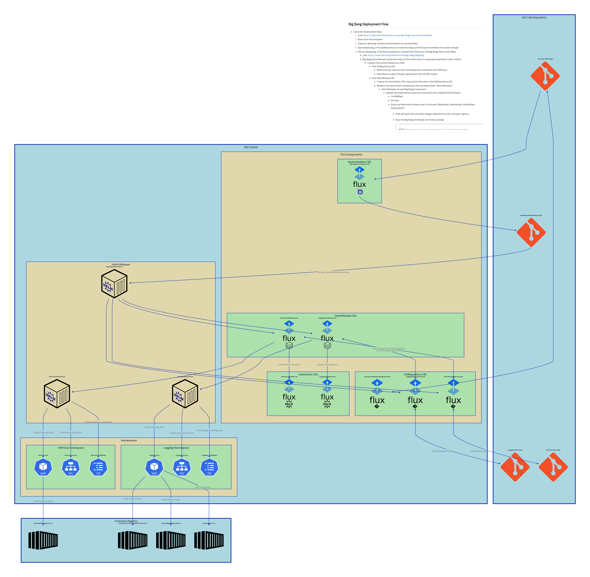

# diagram-as-code

## how to modify
* get d2 cli
* run the following command while editing for diagram preview
```sh
$ d2 --watch input.d2 input.svg
```

## how to export resulting diagram
```sh
$ d2 input.d2 input.png
$ d2 input.d2 input.svg
```


[Big Bang Overview Description](./DESCRIPTION.md)
