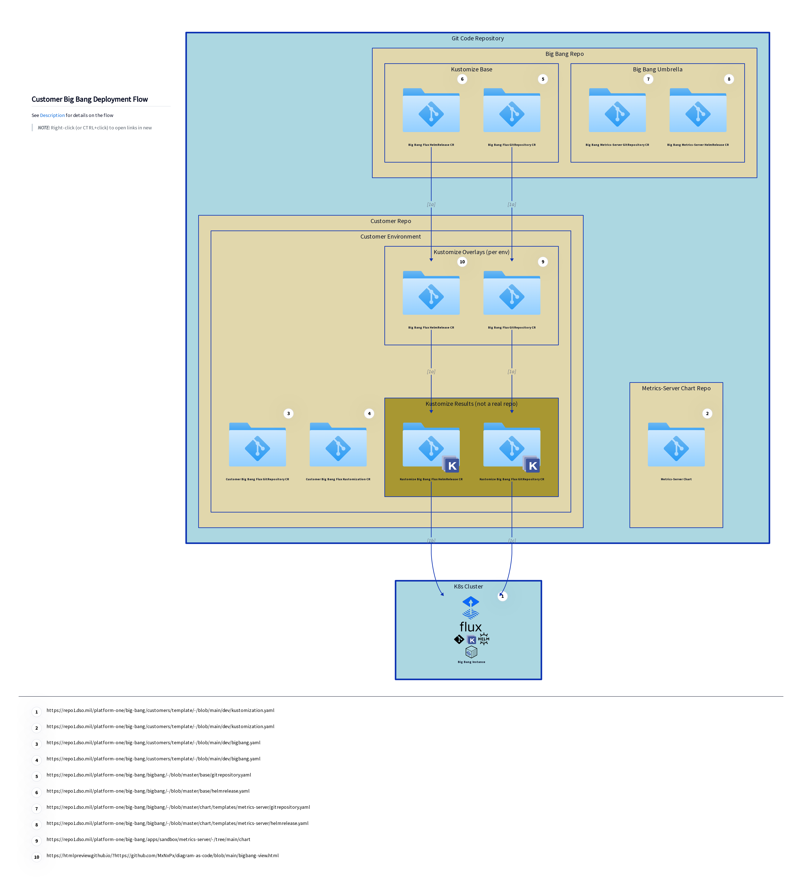

# diagram-as-code

## how to modify
* get d2 cli
* run the following command while editing for diagram preview
```sh
$ d2 --watch bigbang.d2 bigbang.svg
$ d2 --watch customer-bigbang.d2 customer-bigbang.svg
```

## how to export resulting diagram
```sh
$ d2 bigbang.d2 bigbang.svg
$ d2 bigbang.d2 bigbang.png
$ d2 customer-bigbang.d2 customer-bigbang.svg
$ d2 customer-bigbang.d2 customer-bigbang.png
```

## diagram
[](https://raw.githubusercontent.com/MxNxPx/diagram-as-code/main/customer-bigbang.svg?sanitize=true "Redirect to diagram")
[](https://raw.githubusercontent.com/MxNxPx/diagram-as-code/main/bigbang.svg?sanitize=true "Redirect to diagram")


[Big Bang Overview Description](./DESCRIPTION.md)
